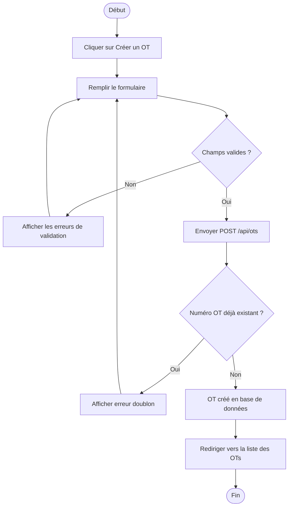

# Diagramme d'activité — Création d'un OT

```mermaid
flowchart TD
    A([Début]) --> B[Cliquer sur Créer un OT]
    B --> C[Remplir le formulaire]
    C --> D{Champs valides ?}
    D -->|Non| E[Afficher les erreurs de validation]
    E --> C
    D -->|Oui| F[Envoyer POST /api/ots]
    F --> G{Numéro OT déjà existant ?}
    G -->|Oui| H[Afficher erreur doublon]
    H --> C
    G -->|Non| I[OT créé en base de données]
    I --> J[Rediriger vers la liste des OTs]
    J --> K([Fin])
```
