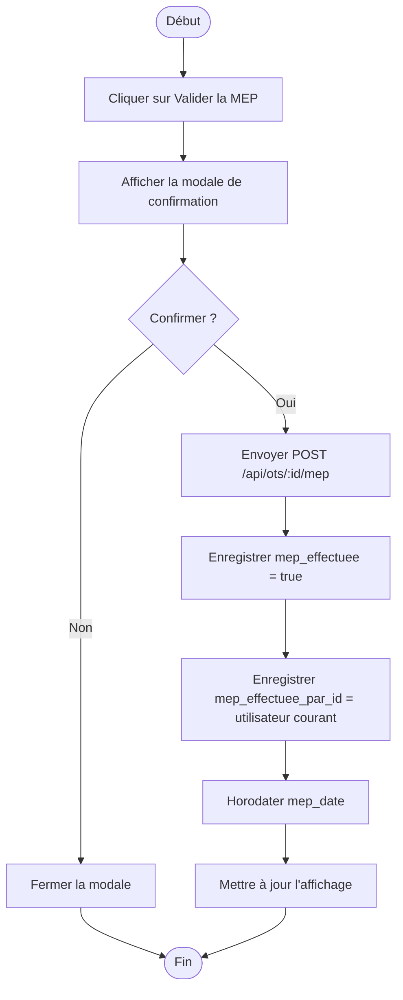

# Diagramme d'activité — Validation MEP

```mermaid
flowchart TD
    A([Début]) --> B[Cliquer sur Valider la MEP]
    B --> C[Afficher la modale de confirmation]
    C --> D{Confirmer ?}
    D -->|Non| E[Fermer la modale]
    E --> F([Fin])
    D -->|Oui| G[Envoyer POST /api/ots/:id/mep]
    G --> H[Enregistrer mep_effectuee = true]
    H --> I[Enregistrer mep_effectuee_par_id = utilisateur courant]
    I --> J[Horodater mep_date]
    J --> K[Mettre à jour l'affichage]
    K --> F
```
