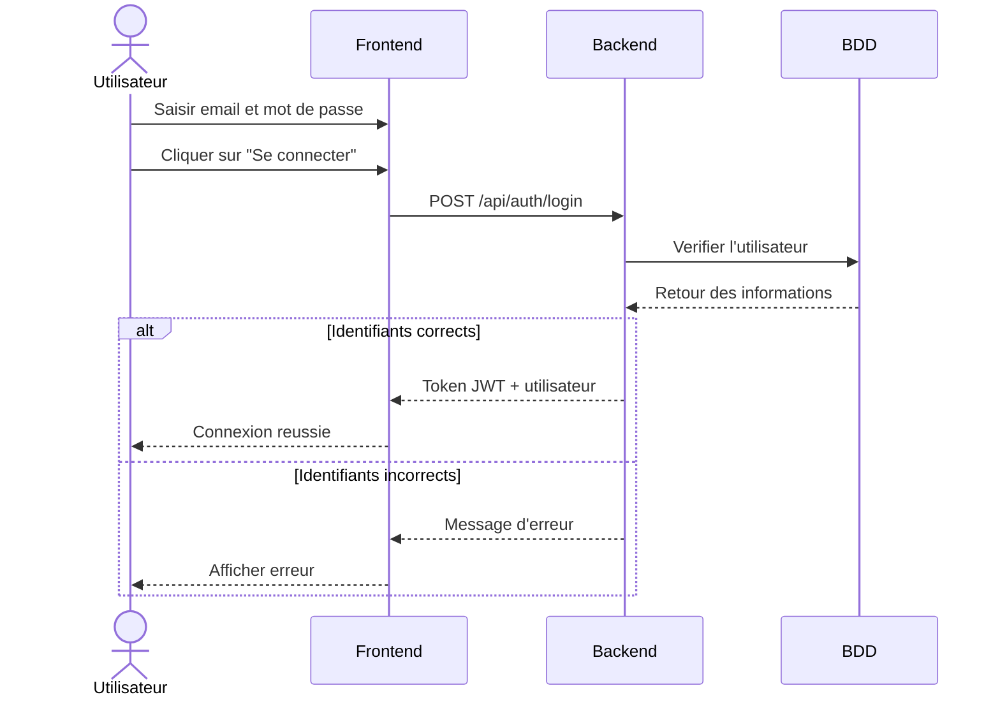

# VIII. Diagramme de sequence : Authentification

```mermaid
sequenceDiagram
    actor Utilisateur
    participant Frontend
    participant Backend
    participant BDD

    Utilisateur->>Frontend: Saisir email et mot de passe
    Utilisateur->>Frontend: Cliquer sur "Se connecter"
    Frontend->>Backend: POST /api/auth/login
    Backend->>BDD: Verifier l'utilisateur
    BDD-->>Backend: Retour des informations

    alt Identifiants corrects
        Backend-->>Frontend: Token JWT + utilisateur
        Frontend-->>Utilisateur: Connexion reussie
    else Identifiants incorrects
        Backend-->>Frontend: Message d'erreur
        Frontend-->>Utilisateur: Afficher erreur
    end
```
